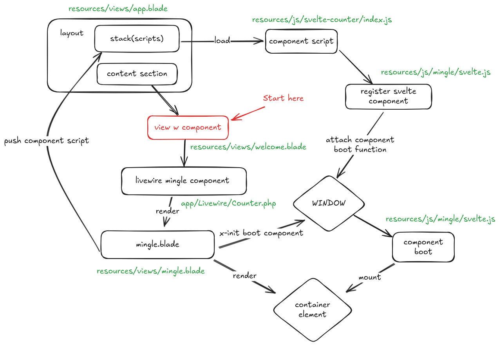

# Standalone Svelte Mingle

## Todo

- Test sending events between components
- Two cases for nested components
  - Parent renders nested on the client (svelte)
  - Parent renders nested on the server (how?)

## How it works

